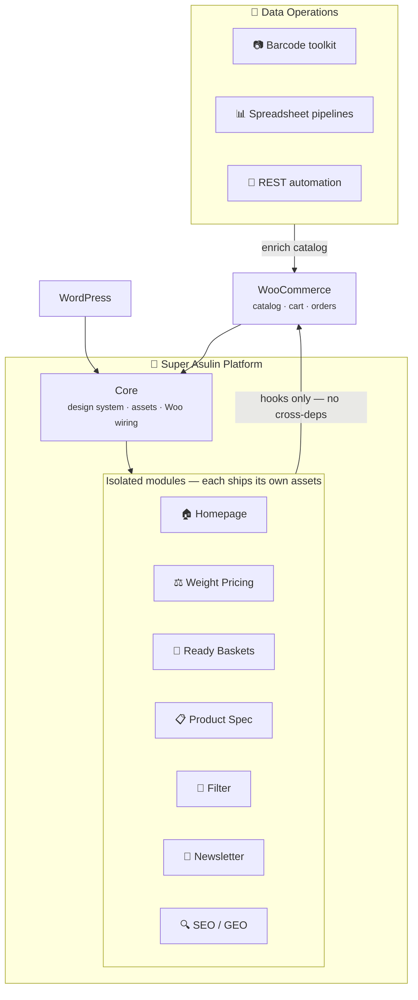
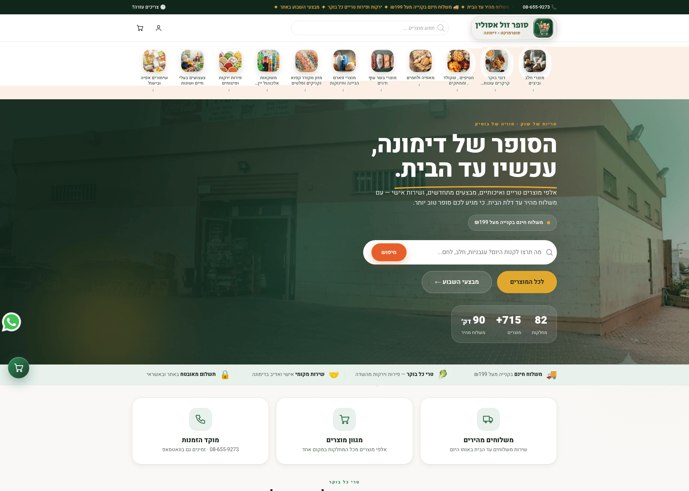
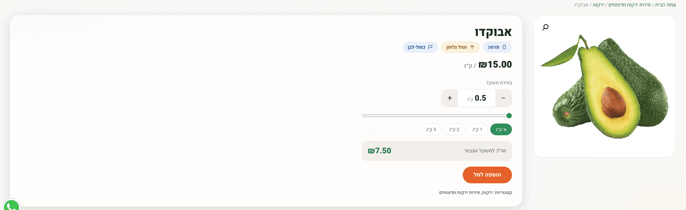
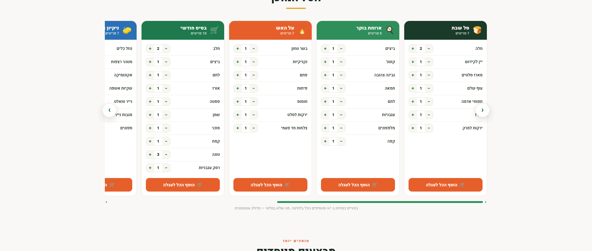
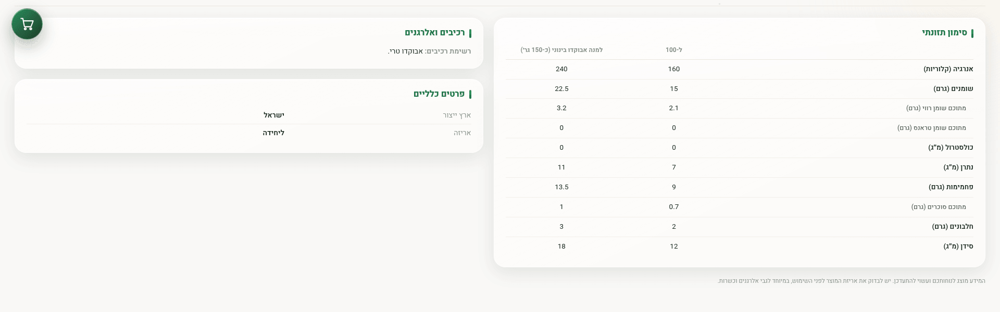
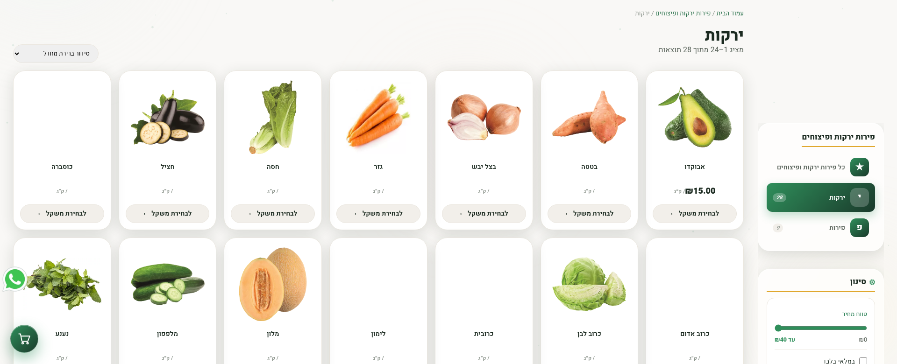
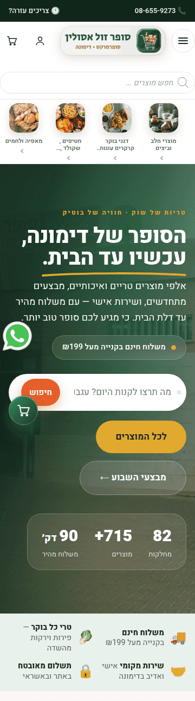

 

# 🛒 Super Asulin

### Premium RTL Grocery E‑Commerce — a bespoke WordPress + WooCommerce platform built end‑to‑end for a real neighborhood supermarket.

*Boutique design system · Sell‑by‑weight engine · One‑click smart baskets · Liquid‑glass UI · Catalog data ops · SEO/GEO*

 

 

**[✨ Live interactive showcase →](https://galasulin.github.io/super-asulin-showcase/)**
*Try the sell‑by‑weight slider and the smart‑basket demo — faithful recreations, demo data only.*

 

> **Showcase repository** — this repo documents the project's capabilities and engineering decisions.
> No source code, credentials, or business data are published here.

 

---

## 📖 The Story

A neighborhood supermarket with **hundreds of live SKUs across 80+ departments** and same‑day delivery was running on a generic store template — slow, visually anonymous, and fighting its own plugins.

**Super Asulin** replaced it with a fully custom platform engineered from a blank `style.css`: a cinematic homepage, a proprietary **sell‑by‑weight engine** for fresh produce, curated **one‑click smart baskets**, a uniform **product spec‑sheet system** with kosher & dietary badges, a coherent **liquid‑glass design system**, abandoned‑cart recovery in Hebrew, and structured data tuned for both search engines and AI answer engines — all **native right‑to‑left**.

Beyond the storefront, the project included full **catalog data operations**: deduplicating a corrupted import, cross‑referencing a 7,000+‑row supplier dataset, and building a **mobile barcode‑scanning toolkit** so the owner can enrich products from the shop floor.

> **Design philosophy:** every feature is an isolated, toggleable module with graceful fallbacks — and zero hard dependencies on paid plugins. Disable any module tomorrow; the store keeps selling.

---

## ✨ Signature Capabilities

<table>
<tr>
<td width="33%" valign="top">

### ⚖️ Sell‑by‑Weight Engine
Per‑product opt‑in pricing **per kilogram**. Customers pick a weight on a live slider — 0.5 to 10 kg in ½‑kg steps — and the price recalculates in real time, flowing cleanly through cart, checkout, and order records.

</td>
<td width="33%" valign="top">

### 🧺 Smart Ready‑Baskets
Eight curated bundles — *Shabbat, Breakfast, BBQ, Monthly Staples, Cleaning, Healthy, Hosting, Coffee & Cake*. Per‑item quantity steppers and **"add everything to cart" in one tap**; out‑of‑stock items skip gracefully.

</td>
<td width="33%" valign="top">

### 📋 Uniform Product Spec System
One template for every product: **kosher & dietary badges** (gluten‑free, Israeli‑made, chilled, frozen), a full **nutrition table**, ingredients & allergens, provenance and packaging — identical layout with or without data.

</td>
</tr>
<tr>
<td valign="top">

### 💎 Liquid‑Glass Design System
Forest‑green & honey palette with orange reserved strictly for CTAs. Sticky glass header, mega‑menu of live categories, backdrop blur, **uniform product cards**, and micro‑interactions respecting `prefers-reduced-motion`.

</td>
<td valign="top">

### 🛒 Conversion & Retention
**Abandoned‑cart recovery emails in Hebrew** with live cart contents, checkout terms consent, order‑cancellation flow, exit‑intent popup, floating cart, and WhatsApp click‑to‑chat.

</td>
<td valign="top">

### 📷 Catalog Data Ops
Deduplicated **575 corrupted imports** safely, cross‑referenced a **7,334‑row supplier dataset**, and shipped a **phone‑camera barcode scanner** (HTML5, offline‑capable) plus spreadsheet pipelines for shop‑floor enrichment.

</td>
</tr>
</table>

---

## 🧩 Module Map

| # | Module | Delivers |
|:-:|---|---|
| 01 | 🏠 **Bespoke Homepage** | Aurora hero · trust bar · value props · fresh‑by‑weight carousel · 8 smart baskets · deals · featured & new grids · verified testimonial · newsletter |
| 02 | ⚖️ **Weight Pricing** | Price/kg engine · live selector · cart & order integration · uniform ½‑kg standard |
| 03 | 🧺 **Ready Baskets** | Curated bundles · quantity steppers · bulk add‑to‑cart · stock‑aware skipping |
| 04 | 📋 **Product Spec Sheet** | Kosher/dietary badges · nutrition table · ingredients & allergens · provenance — one uniform template |
| 05 | 🔎 **Product Filter** | Faceted server‑side filtering — category · price · stock · sale — plugin‑free |
| 06 | 📨 **Newsletter + Exit‑Intent** | Subscriber store · admin dashboard · CSV export · true one‑time exit popup |
| 07 | 💌 **Cart Recovery** | Hebrew email sequences with live cart contents & product images |
| 08 | 🔍 **SEO / GEO** | GroceryStore schema · product JSON‑LD · render‑time meta & keyphrase automation · GA4 + Search Console |
| 09 | 🎠 **Custom Carousels** | Drag‑to‑scroll over links · arrow nav · snap scrolling — dependency‑free |
| 10 | 📷 **Barcode Toolkit** | Phone‑camera scanner (HTML5) · pick‑list & fast‑scan CSV workflows · supplier‑data matching |

---

## 🏗️ Architecture

**Principles**

- 🧱 **Isolated modules** — no cross‑dependencies; disable any module, nothing else breaks
- 🪶 **Zero heavy plugins** — filter, newsletter, carousels, popups and spec sheets built natively
- ♻️ **Graceful fallbacks** — every enhancement degrades safely, `@supports` safety nets included
- 🌍 **RTL‑first** — layout, carousels, and interactions all mirror correctly
- ⚡ **Cache‑aware** — asset strategy engineered around aggressive edge/CDN caching (content‑hash busting)

---

## 🛠️ Tech Stack

| Layer | Choices |
|---|---|
| **Platform** | WordPress custom theme · WooCommerce deep integration |
| **Backend** | PHP 7.2+ · hook‑driven modular architecture · custom post types |
| **Frontend** | Vanilla JavaScript (ES5‑safe, zero frameworks) · semantic HTML5 · HTML5 camera APIs |
| **Styling** | CSS custom properties · Grid & Flexbox · `backdrop-filter` · fluid `clamp()` type · logical properties for RTL |
| **Data & SEO** | Schema.org JSON‑LD · WooCommerce REST automation · Python/openpyxl pipelines · barcode matching |
| **Analytics** | Google Analytics 4 · Search Console · e‑commerce event tracking |
| **Compatibility** | Elementor Pro · FiboSearch · major caching/optimization stacks |

---

## 🎨 Design Tokens

| | Token | Hex | Role |
|:-:|---|---|---|
| 🌲 | **Forest** | `#11261B` | Dark surfaces · header/footer · hero |
| 🥬 | **Fresh Green** | `#2F8F5B` | Primary brand · freshness cue |
| 🍯 | **Honey** | `#E0A82E` | Savings & accents |
| 🔥 | **CTA Orange** | `#E65F2B` | *Strictly* calls‑to‑action |
| 🤍 | **Warm Paper** | `#F9F8F6` | Calm organic canvas |

Typography: fluid `clamp()` scale · 8‑pt spacing rhythm · uniform card geometry.
Motion: aurora gradients · Ken‑Burns hero · reveal‑on‑scroll · tilt & spotlight — all behind `prefers-reduced-motion`.

---

## 📊 By the Numbers

| 🗂️ Catalog | 🏬 Departments | 🧩 Modules | 🧺 Baskets | ⚖️ Weight range | 📄 Supplier dataset | 🌐 RTL | 🔌 Paid plugins |
|:-:|:-:|:-:|:-:|:-:|:-:|:-:|:-:|
| **700+** SKUs | **80+** | **10** | **8** | **0.5–10 kg** | **7,334** rows | **100%** | **0** |

---

## 🔬 Engineering Notes Worth Reading

<b>⚖️ Why the weight engine stores grams but displays kilograms</b>

 

Prices are defined per kg, but all internal math runs in integer grams — eliminating floating‑point drift in cart totals. The display layer formats `1500 → "1.5 kg"` at the last moment. Different weights of the same product become separate cart lines via unique keys, and the per‑kg price is snapshotted at add‑to‑cart time so later price edits never corrupt an open cart.

<b>🎠 Why the carousels use mouse events instead of Pointer Events</b>

 

The produce carousel cards are anchor tags wrapping images — native drag ghosting and link navigation fight pointer‑capture. The final implementation uses document‑level mouse events with `preventDefault`, `draggable=false`, click‑suppression after drag, and disables scroll‑snap mid‑drag. Result: buttery drag‑to‑scroll that works *over links*, in RTL, on every browser tested.

<b>⚡ Surviving aggressive server‑side caching</b>

 

The production host minifies and re‑serves every asset under content‑hash URLs. The theme's asset strategy was designed around that: new files get new hashes automatically, critical overrides ship in dedicated late‑loading files, and `@supports` fallbacks guarantee older browsers never see a broken glass effect.

<b>🔍 SEO that includes products that don't exist yet</b>

 

Meta descriptions and focus keyphrases are generated by filter hooks at render time — not written into the database per product. Every future product inherits rich, localized meta automatically the moment it's published. Zero maintenance, forever.

<b>🧹 Recovering a corrupted catalog without downtime</b>

 

A bad CSV import created 575 duplicate products overnight. Recovery used date‑scoped batch operations against the live store — trashing only the duplicates, verifying originals (with their images and category assignments) survived intact, and cross‑checking final counts. Zero downtime, zero lost products.

<b>📷 A barcode scanner that runs on the owner's phone</b>

 

Product enrichment needed barcodes as a join key against a 7,334‑row supplier dataset. Instead of dedicated hardware, the project shipped a self‑contained HTML5 scanner — phone camera, live decode, local storage, CSV export — hosted over HTTPS so `getUserMedia` works anywhere in the store. Three workflows (pick‑list, app, fast‑scan) let the owner choose speed vs. certainty.

---

## 🖼️ Gallery

**🏠 Homepage** — aurora hero, sticky glass header, live trust bar & value props

**⚖️ Sell‑by‑Weight Engine** — dietary badges under the title, price/kg, live slider (½‑kg steps), preset weights, real‑time total

**🧺 Smart Ready‑Baskets** — curated bundles with per‑item quantity steppers and one‑tap bulk add

**📋 Uniform Product Spec** — full nutrition table, ingredients & allergens, provenance — identical layout for every product

**🔎 Faceted Filter** — department navigation, price‑range slider, stock & sale toggles — RTL, server‑rendered

**📱 Mobile** — the full experience on a phone: hamburger nav, hero, and a 2‑up trust bar

---

## 👤 Author

**Designed & engineered end‑to‑end** — architecture, UI/UX design system, front‑end, WooCommerce integration, SEO layer, analytics, and catalog data tooling.

 

*Crafted with care for a real business, real customers, and real freshness.* 🥬

 

